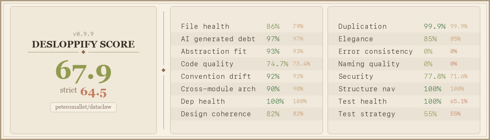

# DataClaw

Turn your Claude Code conversation history into structured training data and publish it to Hugging Face with a single command. DataClaw parses session logs, redacts secrets and PII, and uploads the result as a ready-to-use dataset — so the hours you spend coding with Claude can help make future models better.


Every export is tagged **`dataclaw`** on Hugging Face. Together, they may someday form a growing [distributed dataset](https://huggingface.co/datasets?other=dataclaw) of real-world human-AI coding collaboration.

## Give this to your agent

Paste this into Claude Code (or any coding agent):

```
Help me export my Claude Code conversation history to Hugging Face using DataClaw.
Install it, set up the skill, then walk me through the process.

STEP 1 — INSTALL
  pip install dataclaw
  If that fails: git clone https://github.com/banodoco/dataclaw.git /tmp/dataclaw && pip install /tmp/dataclaw
  If that also fails, ask the user where the source is.

STEP 2 — INSTALL SKILL
  dataclaw update-skill claude

STEP 3 — START
  dataclaw prep
  Every dataclaw command outputs next_steps in its JSON — follow them through the entire flow.

IMPORTANT: Never run bare `huggingface-cli login` — always use --token.
IMPORTANT: Always export with --no-push first and review for PII before publishing.
```

<details>
<summary><b>Manual usage (without an agent)</b></summary>

### Quick start

```bash
pip install dataclaw
huggingface-cli login --token YOUR_TOKEN

# See your projects
dataclaw prep

# Configure
dataclaw config --repo username/my-personal-claude-code-data
dataclaw config --exclude "personal-stuff,scratch"
dataclaw config --redact-usernames "my_github_handle,my_discord_name"
dataclaw config --redact "my-domain.com,my-secret-project"

# Export locally first
dataclaw export --no-push

# Review and confirm
dataclaw confirm

# Push
dataclaw export
```

### Commands

| Command | Description |
|---------|-------------|
| `dataclaw status` | Show current stage and next steps (JSON) |
| `dataclaw prep` | Discover projects, check HF auth, output JSON |
| `dataclaw list` | List all projects with exclusion status |
| `dataclaw config` | Show current config |
| `dataclaw config --repo user/my-personal-claude-code-data` | Set HF repo |
| `dataclaw config --exclude "a,b"` | Add excluded projects (appends) |
| `dataclaw config --redact "str1,str2"` | Add strings to always redact (appends) |
| `dataclaw config --redact-usernames "u1,u2"` | Add usernames to anonymize (appends) |
| `dataclaw config --confirm-projects` | Mark project selection as confirmed |
| `dataclaw export --no-push` | Export locally only (always do this first) |
| `dataclaw confirm` | Scan for PII, summarize export, unlock pushing |
| `dataclaw export` | Export and push (requires `dataclaw confirm` first) |
| `dataclaw export --all-projects` | Include everything (ignore exclusions) |
| `dataclaw export --no-thinking` | Exclude extended thinking blocks |
| `dataclaw update-skill claude` | Install/update the dataclaw skill for Claude Code |
| `dataclaw index` | Build search index from Claude Code sessions |
| `dataclaw search "query"` | Search indexed sessions with BM25 ranking |

</details>

<details>
<summary><b>Local Search</b></summary>

DataClaw can index your Claude Code conversations for fast, offline search using BM25 ranking with confidence scores.

### Quick Start

```bash
# First, build the index (one-time or after new sessions)
dataclaw index

# Or specify a custom Claude Code directory
dataclaw index --claude-dir /path/to/claude/data

# Then search your conversations
dataclaw search "authentication bug"
dataclaw search "API error" --limit 10
dataclaw search "refactor" --min-confidence 50
```

### Search Commands

| Command | Description |
|---------|-------------|
| `dataclaw index` | Scan all projects and build search index |
| `dataclaw index --force` | Rebuild index from scratch |
| `dataclaw index --projects "proj1,proj2"` | Index specific projects only |
| `dataclaw index --claude-dir /path/to/.claude` | Use a custom Claude Code directory |
| `dataclaw search "query"` | Search with BM25 ranking |
| `dataclaw search "query" --limit 10` | Limit results |
| `dataclaw search "query" --min-confidence 50` | Filter by confidence |
| `dataclaw search "query" --json` | Output results as JSON only |
| `dataclaw search "query" --no-anonymize` | Don't anonymize snippets (for debugging) |

### Search Design: Raw Indexing, Anonymized Display

DataClaw's search is designed to balance **searchability** with **privacy**:

- **Raw content is indexed** — Session content is indexed exactly as-is, so you can search for original terms like `/Users/alice/project/file.py` or your actual usernames.
- **Results are anonymized at display time** — When showing search results, snippets are anonymized on-the-fly using scout-core's AnonymizerTool, so paths and usernames are hashed before being displayed.
- **No privacy leak** — The original raw content stays only in your local index (which is stored in `~/.dataclaw/search.db`). It's never sent anywhere.

This means you get full searchability while keeping your exported data privacy-safe.

### Specifying Claude Code Directory

By default, DataClaw looks for Claude Code sessions in `~/.claude`. You can override this:

```bash
# Using CLI flag (any command)
dataclaw index --claude-dir /path/to/claude/data
```

This is useful for:
- Indexing sessions from another machine
- Using a custom Claude Code data location
- Testing with sample data

### Configuration

You can configure search behavior via `dataclaw config`:

```bash
# Set max content length per session (default: 20000 chars)
# This controls how much of each session is indexed
dataclaw config --search-max-content 30000
```

### How It Works

- The index is stored in `~/.dataclaw/search.db`
- Search uses BM25 ranking for relevance
- Confidence scores (0-100) indicate match quality
- Snippets show context around search terms
- Sn before display usingippets are anonymized scout-core's AnonymizerTool

### Requirements

Local search requires scout-core:

```bash
pip install scout-core
# Or for local development:
pip install -e ../scout
```

### Anonymizer Integration

DataClaw uses scout-core's `AnonymizerTool` for consistent, auditable PII redaction. This provides:

- **Deterministic hashing** — Same username always produces the same hash
- **Audit logging** — All anonymization operations are logged to `~/.scout/audit.jsonl`
- **Multiple patterns** — Handles `/Users/username/`, `/home/username/`, `-Users-username-`, temp paths, and more
- **Extra usernames** — Additional usernames (GitHub handles, etc.) from your config are also hashed

The anonymizer is applied at display time to search snippets, not during indexing, ensuring you can find your conversations while keeping displayed results privacy-safe.

</details>

<details>
<summary><b>What gets exported</b></summary>

| Data | Included | Notes |
|------|----------|-------|
| User messages | Yes | Full text (including voice transcripts) |
| Assistant responses | Yes | Full text output |
| Extended thinking | Yes | Claude's reasoning (opt out with `--no-thinking`) |
| Tool calls | Yes | Tool name + summarized input |
| Tool results | No | Not stored in Claude Code's logs |
| Token usage | Yes | Input/output tokens per session |
| Model & metadata | Yes | Model name, git branch, timestamps |

### Privacy & Redaction

DataClaw applies multiple layers of protection:

1. **Path anonymization** — File paths stripped to project-relative (powered by scout-core)
2. **Username hashing** — Your macOS username + any configured usernames replaced with stable hashes (powered by scout-core)
3. **Secret detection** — Regex patterns catch JWT tokens, API keys (Anthropic, OpenAI, HF, GitHub, AWS, etc.), database passwords, private keys, Discord webhooks, and more
4. **Entropy analysis** — Long high-entropy strings in quotes are flagged as potential secrets
5. **Email redaction** — Personal email addresses removed
6. **Custom redaction** — You can configure additional strings and usernames to redact
7. **Tool input pre-redaction** — Secrets in tool inputs are redacted BEFORE truncation to prevent partial leaks

> **Note:** Username and path anonymization is powered by scout-core. Audit logs for anonymization are stored in `~/.scout/audit.jsonl`.

**This is NOT foolproof.** Always review your exported data before publishing.
Automated redaction cannot catch everything — especially service-specific
identifiers, third-party PII, or secrets in unusual formats.

To help improve redaction, report issues: https://github.com/banodoco/dataclaw/issues

</details>

<details>
<summary><b>Data schema</b></summary>

Each line in `conversations.jsonl` is one session:

```json
{
  "session_id": "abc-123",
  "project": "my-project",
  "model": "claude-opus-4-6",
  "git_branch": "main",
  "start_time": "2025-06-15T10:00:00+00:00",
  "end_time": "2025-06-15T10:30:00+00:00",
  "messages": [
    {"role": "user", "content": "Fix the login bug", "timestamp": "..."},
    {
      "role": "assistant",
      "content": "I'll investigate the login flow.",
      "thinking": "The user wants me to look at...",
      "tool_uses": [{"tool": "Read", "input": "src/auth.py"}],
      "timestamp": "..."
    }
  ],
  "stats": {
    "user_messages": 5, "assistant_messages": 8,
    "tool_uses": 20, "input_tokens": 50000, "output_tokens": 3000
  }
}
```

Each HF repo also includes a `metadata.json` with aggregate stats.

</details>

<details>
<summary><b>Finding datasets on Hugging Face</b></summary>

All repos are named `{username}/my-personal-claude-code-data` and tagged `dataclaw`.

- **Browse all:** [huggingface.co/datasets?other=dataclaw](https://huggingface.co/datasets?other=dataclaw)
- **Load one:**
  ```python
  from datasets import load_dataset
  ds = load_dataset("alice/my-personal-claude-code-data", split="train")
  ```
- **Combine several:**
  ```python
  from datasets import load_dataset, concatenate_datasets
  repos = ["alice/my-personal-claude-code-data", "bob/my-personal-claude-code-data"]
  ds = concatenate_datasets([load_dataset(r, split="train") for r in repos])
  ```

The auto-generated HF README includes:
- Model distribution (which Claude models, how many sessions each)
- Total token counts
- Project count
- Last updated timestamp

</details>

## Code Quality

<p align="center">
  
</p>

## License

MIT
