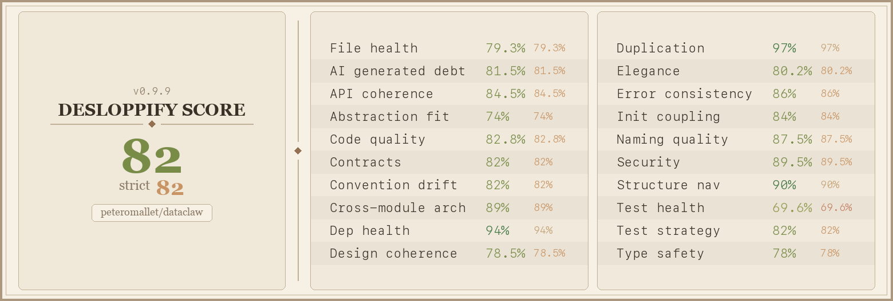

# DataClaw

Review, score, and curate your coding agent conversation traces locally. DataClaw indexes session logs from Claude Code, Codex, Gemini CLI, OpenCode, OpenClaw, Kimi CLI, and Cline, redacts secrets and PII, and gives you a browser workbench to triage and export the results.


## Review & score your traces

Index your local sessions, auto-score them for quality, and open a browser workbench — all in three commands:

```bash
pip install git+https://github.com/kaiaiagent/dataclaw.git
dataclaw scan                                   # Index all local sessions
dataclaw score --batch --auto-triage             # AI-score sessions, auto-approve 4-5, auto-block 1-2
dataclaw serve                                   # Open workbench at localhost:8384
```

`score --batch` sends each session to Claude for evaluation (1-5 quality rating) and `--auto-triage` automatically approves high-quality sessions and blocks low-quality ones, leaving score-3 sessions for your manual review. The workbench gives you a full browser UI to read transcripts, adjust scores, search across sessions, and bundle approved traces for export.

## Give this to your agent

Paste this into Claude Code, Codex, Gemini CLI, OpenCode, OpenClaw, or any coding agent:

```
Help me review and curate my coding agent traces using DataClaw.
Install it, set up the skill, then walk me through the process.

STEP 1 — INSTALL
  pip install git+https://github.com/kaiaiagent/dataclaw.git
  If that fails: git clone https://github.com/kaiaiagent/dataclaw.git /tmp/dataclaw && pip install /tmp/dataclaw
  If that also fails, ask the user where the source is.

STEP 2 — INSTALL SKILL
  dataclaw update-skill claude

STEP 3 — SCAN & SCORE
  dataclaw scan                              # Index sessions into local DB
  dataclaw score --batch --auto-triage       # AI-score + auto-approve/block

STEP 4 — REVIEW
  dataclaw serve                             # Open workbench at localhost:8384

Tell the user: "Your workbench is open at localhost:8384. Everything is 100% local.
Use the Inbox to triage traces, Search to find sessions, and Bundles to assemble exports."
```

<details>
<summary><b>Manual usage (without an agent)</b></summary>

### Quick start

```bash
pip install git+https://github.com/kaiaiagent/dataclaw.git

# Scan and score
dataclaw scan
dataclaw score --batch --auto-triage

# Open the workbench
dataclaw serve

# Or triage from the terminal
dataclaw inbox --json --limit 20
dataclaw approve <session-id> --reason "good trace"
dataclaw block <session-id> --reason "low quality"

# Configure redactions and exclusions
dataclaw config --exclude "personal-stuff,scratch"
dataclaw config --redact-usernames "my_github_handle,my_discord_name"
dataclaw config --redact "my-domain.com,my-secret-project"

# Export locally
dataclaw export --no-push --output /tmp/dataclaw_export.jsonl
```

### Commands

| Command | Description |
|---------|-------------|
| `dataclaw scan` | Index local sessions into workbench DB |
| `dataclaw score --batch --auto-triage` | AI-score all unscored sessions, auto-approve 4-5 and block 1-2 |
| `dataclaw score --batch --limit 20` | AI-score up to 20 sessions without triage |
| `dataclaw serve` | Open workbench UI at localhost:8384 |
| `dataclaw inbox --json --limit 20` | List sessions as JSON (for agent parsing) |
| `dataclaw approve <id> [id ...]` | Approve sessions by ID |
| `dataclaw block <id> [id ...]` | Block sessions by ID |
| `dataclaw shortlist <id> [id ...]` | Shortlist sessions for review |
| `dataclaw config --source all` | Select source scope (`claude`, `codex`, `gemini`, `opencode`, `openclaw`, `kimi`, or `all`) |
| `dataclaw config --exclude "a,b"` | Add excluded projects (appends) |
| `dataclaw config --redact "str1,str2"` | Add strings to always redact (appends) |
| `dataclaw config --redact-usernames "u1,u2"` | Add usernames to anonymize (appends) |
| `dataclaw export --no-push` | Export to local JSONL |
| `dataclaw export --no-thinking` | Exclude extended thinking blocks |
| `dataclaw list` | List all projects with exclusion status |
| `dataclaw status` | Show current stage and next steps (JSON) |
| `dataclaw update-skill claude` | Install/update the dataclaw skill for Claude Code |

</details>

<details>
<summary><b>What gets exported</b></summary>

| Data | Included | Notes |
|------|----------|-------|
| User messages | Yes | Full text (including voice transcripts) |
| Assistant responses | Yes | Full text output |
| Extended thinking | Yes | Claude's reasoning (opt out with `--no-thinking`) |
| Tool calls | Yes | Tool name + inputs + outputs |
| Token usage | Yes | Input/output tokens per session |
| Model & metadata | Yes | Model name, git branch, timestamps |

### Privacy & Redaction

DataClaw applies multiple layers of protection:

1. **Path anonymization** — File paths stripped to project-relative
2. **Username hashing** — Your macOS username + any configured usernames replaced with stable hashes
3. **Secret detection** — Regex patterns catch JWT tokens, API keys (Anthropic, OpenAI, HF, GitHub, AWS, etc.), database passwords, private keys, Discord webhooks, and more
4. **Entropy analysis** — Long high-entropy strings in quotes are flagged as potential secrets
5. **Email redaction** — Personal email addresses removed
6. **Custom redaction** — You can configure additional strings and usernames to redact
7. **Tool call redaction** — Secrets in tool inputs and outputs are redacted

**This is NOT foolproof.** Always review your exported data before sharing.
Automated redaction cannot catch everything — especially service-specific
identifiers, third-party PII, or secrets in unusual formats.

To help improve redaction, report issues: https://github.com/kaiaiagent/dataclaw/issues

</details>

<details>
<summary><b>Data schema</b></summary>

Each line in `conversations.jsonl` is one session:

```json
{
  "session_id": "abc-123",
  "project": "my-project",
  "model": "claude-opus-4-6",
  "git_branch": "main",
  "start_time": "2025-06-15T10:00:00+00:00",
  "end_time": "2025-06-15T10:30:00+00:00",
  "messages": [
    {"role": "user", "content": "Fix the login bug", "timestamp": "..."},
    {
      "role": "assistant",
      "content": "I'll investigate the login flow.",
      "thinking": "The user wants me to look at...",
      "tool_uses": [
          {
            "tool": "bash",
            "input": {"command": "grep -r 'login' src/"},
            "output": {"text": "src/auth.py:42: def login(user, password):"},
            "status": "success"
          }
        ],
      "timestamp": "..."
    }
  ],
  "stats": {
    "user_messages": 5, "assistant_messages": 8,
    "tool_uses": 20, "input_tokens": 50000, "output_tokens": 3000
  }
}
```

</details>

## Code Quality

<p align="center">
  
</p>

## License

MIT
